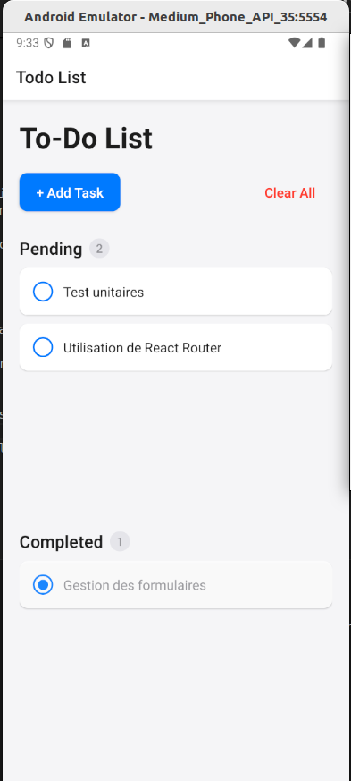
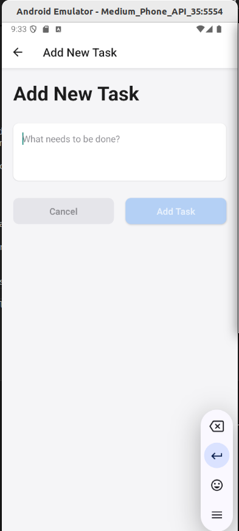

# Todo List

|   Nom   | Prénom |
|---------|--------|
|   LARAICH   |  Abir  |


## Technologies requises

Vous allez avoir besoin des technologies suivantes :
- [Android Studio](https://developer.android.com/studio "Android Studio") et la JDK.
- [NodeJS LTS](https://nodejs.org/fr "NodeJS")


Une fois Android installé, vous devez ajouter la SDK au Path :
```bash
export ANDROID_HOME=~/Android/Sdk
export PATH=$PATH:$ANDROID_HOME/tools:$ANDROID_HOME/tools/bin:$ANDROID_HOME/platform-tools
```

## Fonctionnalités

L'application permet de :
- **Ajouter une tâche** à réaliser.
- **Voir les tâches** en cours et les tâches complétées.
- **Supprimer** une ou plusieurs tâches.
- **Changer le statut** d'une tâche (de "complétée" à "en cours" et inversement).
- **Persistance des tâches** via `Expo.SecureStore` pour les stocker même après la fermeture de l'application.
- **Suppression par balayage (swipe)** d'une tâche dans la liste.

## Lancer le projet

Pour lancer l'application dans un émulateur Android :

```bash
npx expo run:android
```

## Fonctionnalités supplémentaires

- **Effets visuels** : L'application utilise des effets visuels tels que des ombres et des animations pour améliorer l'expérience utilisateur.
- **Swipeable** : Les utilisateurs peuvent balayer une tâche vers la gauche pour la supprimer facilement.

## Structure du Projet

- **App.tsx** : Le point d'entrée principal qui gère la navigation entre les écrans "Home" et "AddTask".
- **HomeScreen.tsx** : Gère l'affichage des tâches en cours et complétées, permet de changer le statut d'une tâche ou de la supprimer.
- **AddTaskScreen.tsx** : Gère l'ajout de nouvelles tâches et la gestion des erreurs si l'entrée est vide.
- **Expo SecureStore** : Gère la persistance des données localement.

## Aperçu

| Accueil | Ajout d'une Tâche |
|---------|-------------------|
|  |  |
